# Document-IDPS-Suricata

Implementation of an Intrusion Detection and Prevention System (IDS/IPS) using Suricata. Developed and tested custom detection rules for various attack scenarios including port scanning, SSH brute-force, HTTP anomalies, TCP flag manipulation, and exploit detection.

# Project Overview

The objective of this project was to deploy Suricata in IPS mode and develop custom detection and prevention rules for multiple attack scenarios in a controlled virtual lab environment.

The lab consisted of two Kali Linux virtual machines connected within the same NAT network:

- **Kali Suricata** – hosted the Suricata engine operating in IPS mode.
- **Kali VM** – used to generate attack traffic and validate detection rules.

The project demonstrates practical experience with intrusion detection, intrusion prevention, traffic analysis, and custom rule development.

---

# Lab Architecture

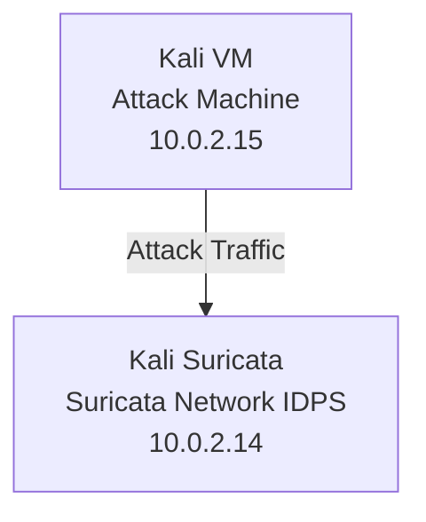

# Suricata Configuration

Suricata was installed and configured on a Kali Linux virtual machine operating in IPS mode. Traffic inspection was enabled using NFQUEUE, allowing Suricata to analyze and block malicious traffic in real time.

Custom detection rules were maintained in a dedicated `local.rules` file and loaded through the main Suricata configuration. Logging was configured using `fast.log` and `eve.json`, and the deployment was validated using Suricata's built-in configuration testing mode.

### NFQUEUE Configuration

Traffic was redirected to Suricata through NFQUEUE for inline inspection and prevention.

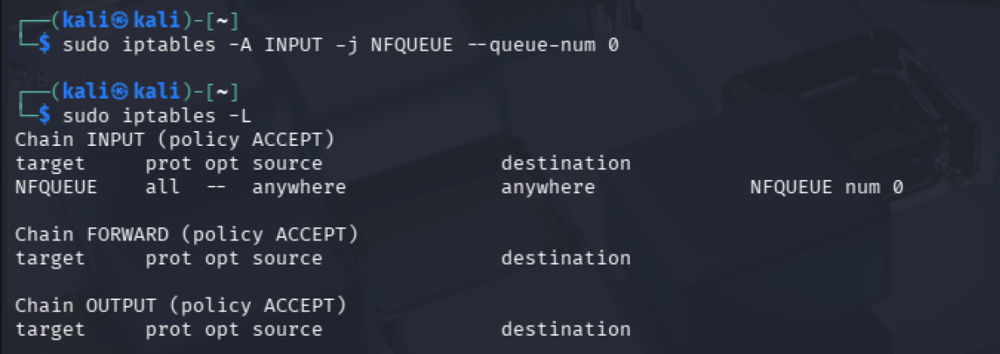

### Custom Rule Loading

A dedicated `local.rules` file was created and loaded through the Suricata configuration.

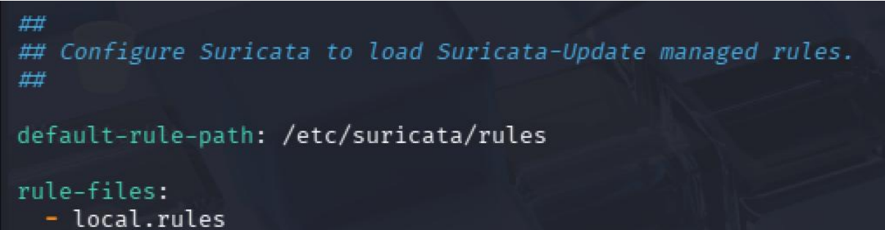

### Configuration Validation

The configuration was verified before deployment using Suricata test mode.

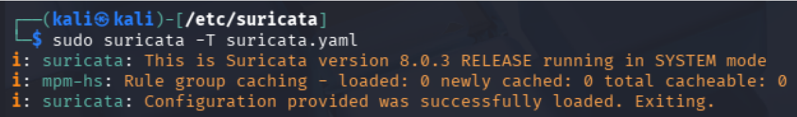

---

# Detection & Prevention Rules

## 1. Port Scan Detection

Implemented a custom Suricata rule to detect TCP SYN scans targeting ports between 100 and 1000.

### Test

The rule was validated by performing a TCP SYN port scan from the Kali VM machine against the Kali Suricata machine using Nmap.

```bash
nmap -sS -p 100-1100 10.0.2.14
```
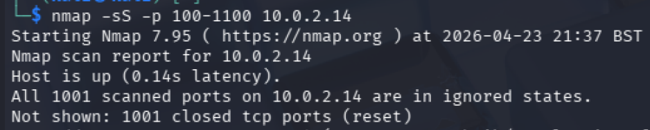

### Result

Suricata successfully detected the scan activity and generated alerts for connections targeting ports within the configured range.

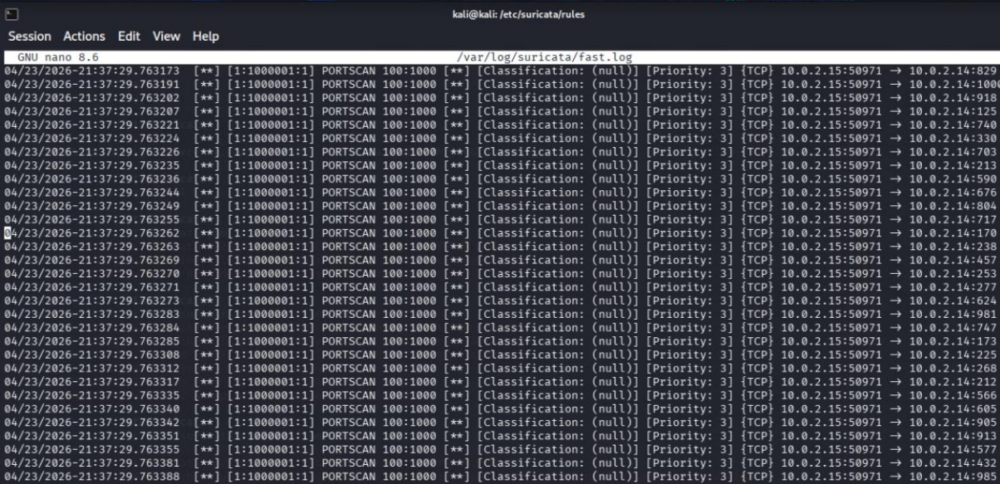

---

## 2. SSH Brute-Force Detection

Implemented a Suricata rule designed to detect and block SSH brute-force attacks. The rule triggers when more than 10 connection attempts are made from the same source IP address within a 30-second time window.

### Test

The detection was validated by performing a dictionary-based SSH brute-force attack from the Kali VM against the SSH service running on Kali Suricata using Hydra.

```bash
hydra -l admin -P rockyou.txt ssh://10.0.2.14
```

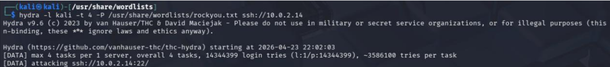

### Result

After exceeding the configured threshold of 10 connection attempts within 30 seconds, Suricata generated an alert and blocked further connection attempts originating from the attacking host.

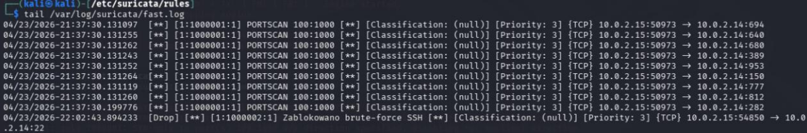

---

## 3. HTTP 404 Detection

Implemented a rule that detects HTTP responses returning status code 404.

### Test

The rule was validated by generating a request from the Kali VM to a non-existent resource on Google, resulting in an HTTP 404 response.

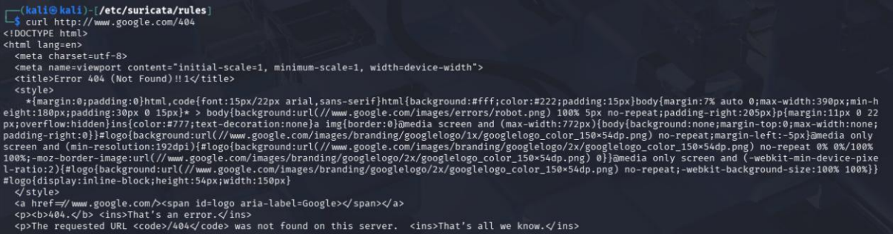

### Result

Suricata successfully detected the HTTP 404 response and generated an alert.


---

## 4. Executable Download Detection

Implemented a rule detecting downloads of executable files over HTTP.

### Test

To simulate an executable download, a simple HTTP server was started on the Kali VM using Python.


A test executable file was then downloaded from the Kali Suricata machine using `wget`.

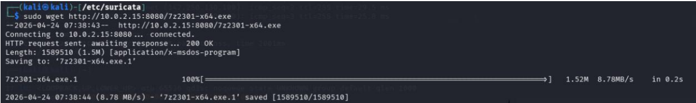

### Result

During the download, Suricata inspected the HTTP request and detected the `.exe` file transfer. The event was successfully logged and an alert was generated in `fast.log`.


---

## 5. Tor Domain Detection

Implemented a rule blocking DNS queries for domains ending with `.onion`.

### Test

The detection was validated by generating a DNS lookup request from the Kali VM.

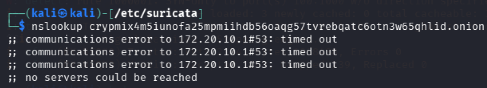

### Result

The DNS query was blocked and logged by Suricata.

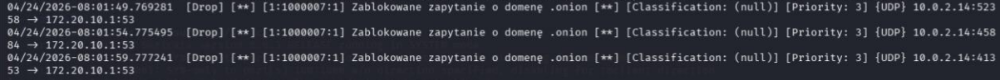

---

## 6. Shellshock Exploitation Detection

Implemented a Suricata rule designed to detect and block Shellshock exploitation attempts by inspecting HTTP headers for the characteristic payload pattern `() {`.

### Test

A simple HTTP server was started on Kali Suricata to simulate a web application endpoint.

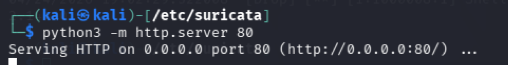

The detection was validated by sending an HTTP request from the Kali VM containing a Shellshock payload in the `User-Agent` header.

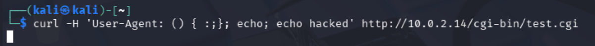

### Result

Suricata successfully detected the Shellshock payload, blocked the request, and generated an alert indicating an exploitation attempt.


---

# Key Learning Outcomes

Through this project, I gained practical experience in deploying and operating a network-based IDPS, creating custom Suricata rules, analyzing network traffic, and testing detection capabilities against common attack techniques.

This project will continue to evolve with additional detection rules, new attack scenarios, and further experimentation with Suricata to expand its detection and prevention capabilities.
