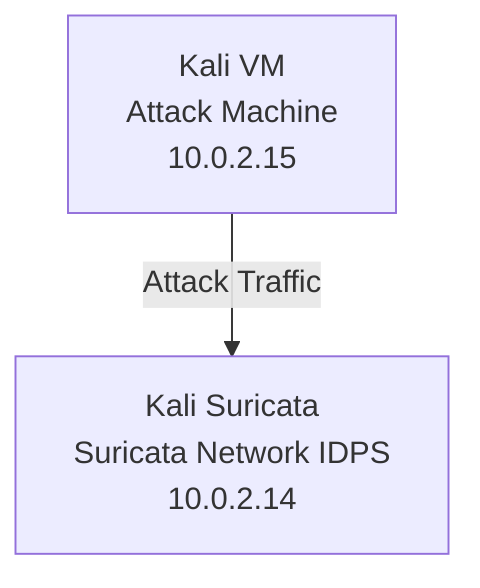

# Document-IDPS-Suricata

Implementation of an Intrusion Detection and Prevention System (IDS/IPS) using Suricata. Developed and tested custom detection rules for various attack scenarios including port scanning, SSH brute-force, HTTP anomalies, TCP flag manipulation, and exploit detection.

# Project Overview

The objective of this project was to deploy Suricata in IPS mode and develop custom detection and prevention rules for multiple attack scenarios in a controlled virtual lab environment.

The lab consisted of two Kali Linux virtual machines connected within the same NAT network:

- **Kali Suricata** – hosted the Suricata engine operating in IPS mode.
- **Kali VM** – used to generate attack traffic and validate detection rules.

The project demonstrates practical experience with intrusion detection, intrusion prevention, traffic analysis, and custom rule development.

---

# Lab Architecture



# Suricata Configuration

Suricata was installed and configured on a Kali Linux virtual machine operating in IPS mode. Traffic inspection was enabled using NFQUEUE, allowing Suricata to analyze and block malicious traffic in real time.

Custom detection rules were maintained in a dedicated `local.rules` file and loaded through the main Suricata configuration. Logging was configured using `fast.log` and `eve.json`, and the deployment was validated using Suricata's built-in configuration testing mode.

### NFQUEUE Configuration

Traffic was redirected to Suricata through NFQUEUE for inline inspection and prevention.


### Custom Rule Loading

A dedicated `local.rules` file was created and loaded through the Suricata configuration.


### Configuration Validation

The configuration was verified before deployment using Suricata test mode.


---

# Detection & Prevention Rules

## 1. Port Scan Detection

Implemented a custom Suricata rule to detect TCP SYN scans targeting ports between 100 and 1000.

### Test

The rule was validated by performing a TCP SYN port scan from the Kali VM machine against the Kali Suricata machine using Nmap.

```bash
nmap -sS -p 100-1100 10.0.2.14
```


### Result

Suricata successfully detected the scan activity and generated alerts for connections targeting ports within the configured range.


---

## 2. SSH Brute-Force Detection

Implemented a rule that detects excessive SSH login attempts originating from a single source.

### Test

```bash
hydra -l admin -P rockyou.txt ssh://10.0.2.14
```

### Result

The attack was detected and blocked after exceeding the configured threshold.


---

