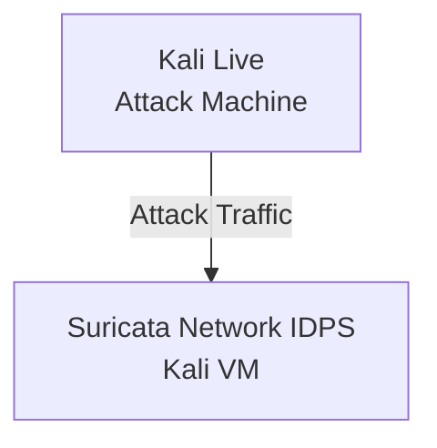

# Document-IDPS-Suricata

Implementation of an Intrusion Detection and Prevention System (IDS/IPS) using Suricata. Developed and tested custom detection rules for various attack scenarios including port scanning, SSH brute-force, HTTP anomalies, TCP flag manipulation, and exploit detection.

# Project Overview

The objective of this project was to deploy Suricata in IPS mode and develop custom detection and prevention rules for multiple attack scenarios in a controlled virtual lab environment.

The lab consisted of two Kali Linux virtual machines connected within the same NAT network:

- **Kali Suricata** – hosted the Suricata engine operating in IPS mode.
- **Kali VM** – used to generate attack traffic and validate detection rules.

The project demonstrates practical experience with intrusion detection, intrusion prevention, traffic analysis, and custom rule development.

---

# Lab Architecture

